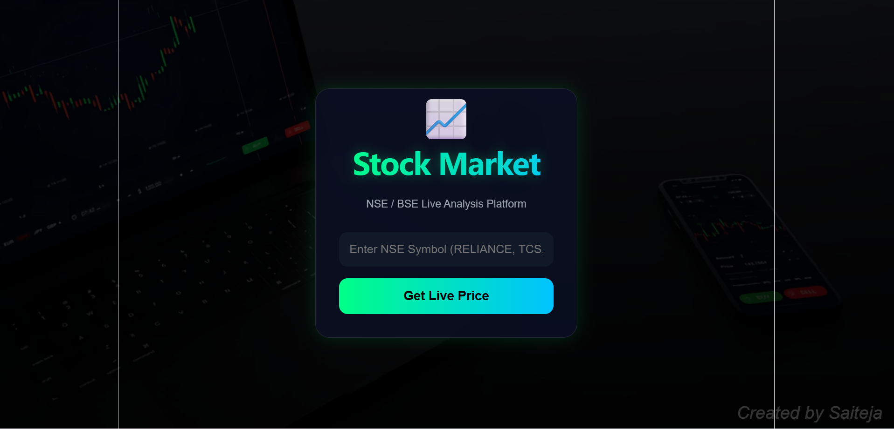

# Stock Market Analysis API

# 📈 Stock Market Analysis API

FastAPI-powered Stock Market Analysis API for NSE/BSE with real-time market data, technical indicators, and AI-powered stock insights.

[](https://stock-market-frontend-nine.vercel.app/)
[](https://github.com/iamsaiteja/stock-market-api)

[]()
[]()
[]()
[]()
[]()
[]()

---

## 📸 Screenshots

### Dashboard



FastAPI + yfinance build **NSE/BSE Stock Analysis API**.

##  Features
- Live stock prices (NSE & BSE)
- AI-based Buy/Sell/Hold predictions
- Technical indicators: RSI, MACD, Bollinger Bands, SMA
- Historical OHLCV data
- Bulk operations

## ⚡ Quick Start

```bash
# 1. Dependencies install 
pip install -r requirements.txt

# 2. Server start ం
uvicorn app.main:app --reload --port 8000

# 3. Docs open ం
# http://localhost:8000/docs
```

##  API Endpoints

| Method | Endpoint | Description |
|--------|----------|-------------|
| GET | `/api/v1/stocks/{symbol}/price` | Live price |
| GET | `/api/v1/stocks/{symbol}/history` | Historical data |
| GET | `/api/v1/stocks/popular/nse` | Top 10 NSE stocks |
| POST | `/api/v1/stocks/bulk` | Multiple prices |
| GET | `/api/v1/predict/{symbol}` | AI prediction |
| POST | `/api/v1/predict/bulk` | Bulk predictions |

##  Example Usage

```bash
# Reliance live price
curl http://localhost:8000/api/v1/stocks/RELIANCE/price

# TCS AI prediction
curl http://localhost:8000/api/v1/predict/TCS

# Historical data (6 months)
curl http://localhost:8000/api/v1/stocks/INFY/history?period=6mo

# Bulk prices
curl -X POST http://localhost:8000/api/v1/stocks/bulk \
  -H "Content-Type: application/json" \
  -d '["RELIANCE", "TCS", "INFY"]'
```

## AI Prediction Response Example

```json
{
  "symbol": "RELIANCE.NS",
  "company_name": "Reliance Industries Limited",
  "current_price": 2850.45,
  "signal": "BUY",
  "confidence": 71.4,
  "risk_level": "MEDIUM",
  "target_price": 2995.00,
  "stop_loss": 2707.93,
  "reasons": [
    "✅ RSI 38.2 — Oversold zone, bounce expected",
    "✅ MACD (12.3) > Signal (8.1) — Bullish crossover",
    "✅ Price ₹2850 > SMA20 ₹2820 — Uptrend "
  ]
}
```

